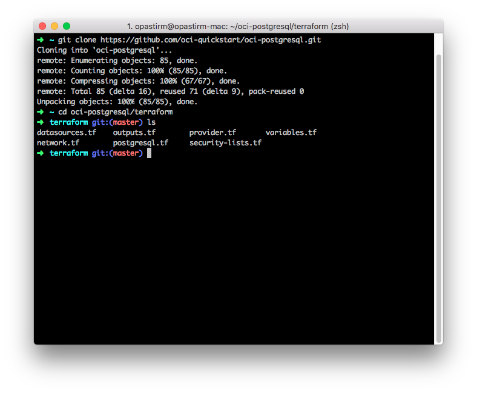
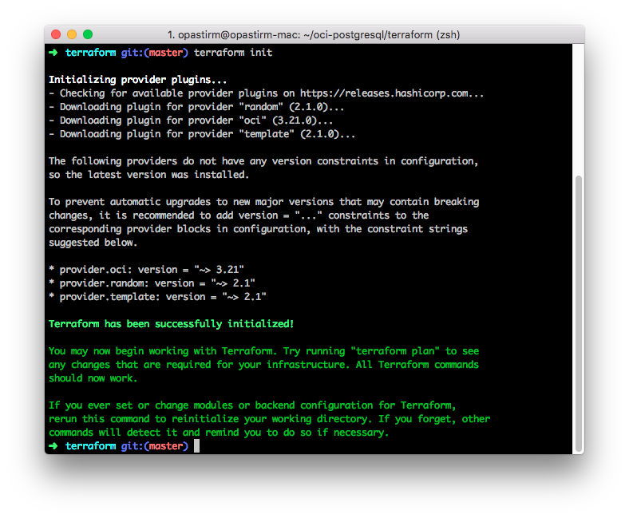
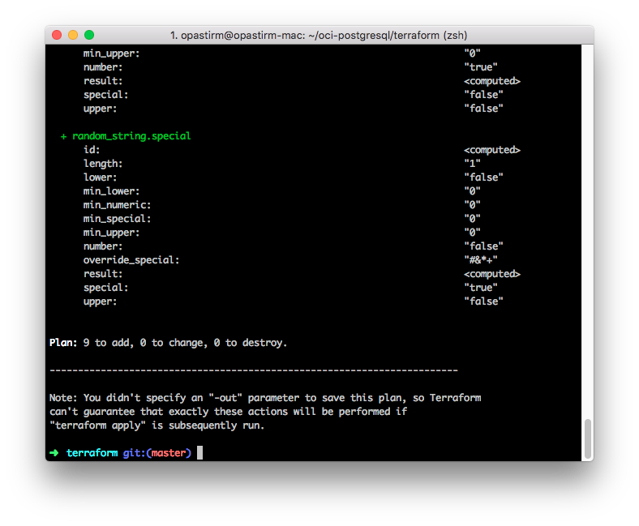
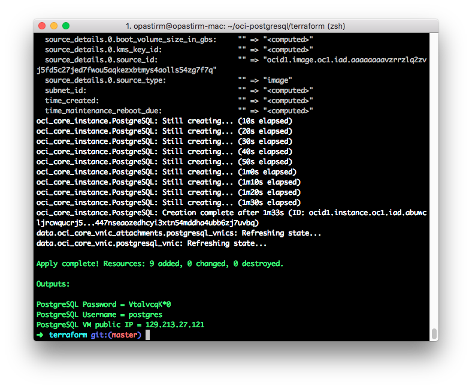
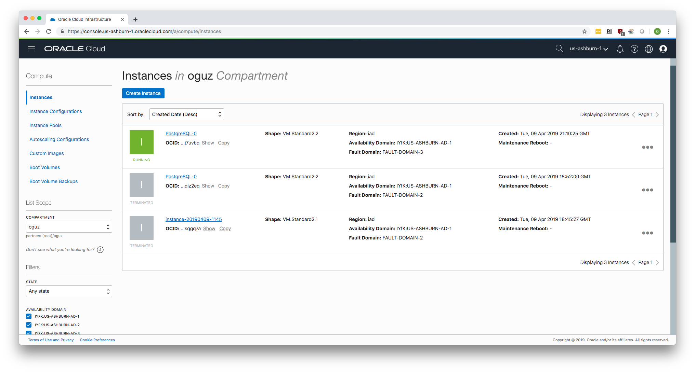
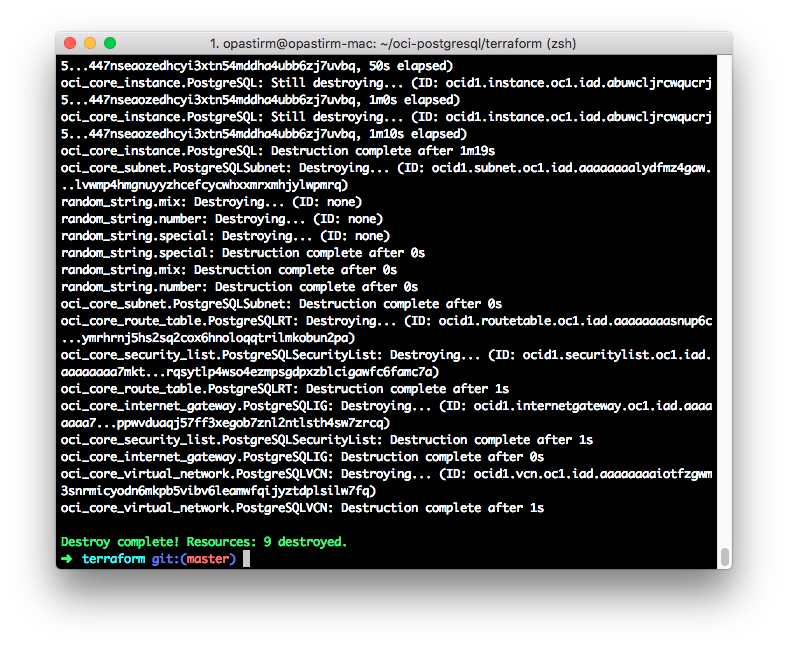

# oci-postgresql
These are Terraform modules that deploy [PostgreSQL](https://www.postgresql.org/) on [Oracle Cloud Infrastructure (OCI)](https://cloud.oracle.com/en_US/cloud-infrastructure).

## Prerequisites
First off you'll need to do some pre deploy setup.  That's all detailed [here](https://github.com/cloud-partners/oci-prerequisites).

## Clone the Module
Now, you'll want a local copy of this repo.  You can make that with the commands:

    git clone https://github.com/oci-quickstart/oci-postgresql.git
    cd cd oci-postgresql/terraform
    ls

That should give you this:

## Initialize the deployment

We now need to initialize the directory with the module in it.  This makes the module aware of the OCI provider.  You can do this by running:

    terraform init

This gives the following output:

## Deploy the module
Now for the main attraction.  Let's make sure the plan looks good:

    terraform plan

That gives:

If that's good, we can go ahead and apply the deploy:

    terraform apply

You'll need to enter `yes` when prompted.  Once complete, you'll see something like this:

When the apply is complete, the infrastructure will be deployed, but cloud-init scripts will still be running.  Those will wrap up asynchronously.  So, it'll be a few more minutes before your cluster is accessible.  Now is a good time to get a coffee.

When the deployment is completed, it will show you the public IP of the instance created on Oracle Cloud Infrastructure (OCI). SSH into that public IP using the username opc:

`ssh opc@<public IP of the instance>`

Example:

`PostgreSQL Password = VtalvcqK*0`

`PostgreSQL Username = postgres`

`PostgreSQL VM public IP = 129.213.27.121`

## View the instance in the Console
You can also login to the web console [here](https://console.us-phoenix-1.oraclecloud.com/a/compute/instances) to view the IaaS that is running the cluster.

## Destroy the Deployment
When you no longer need the deployment, you can run this command to destroy it:

    terraform destroy

You'll need to enter `yes` when prompted.

